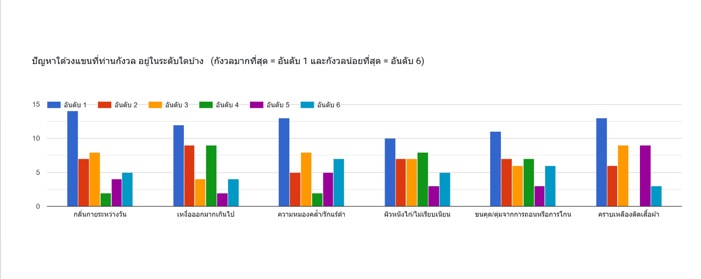
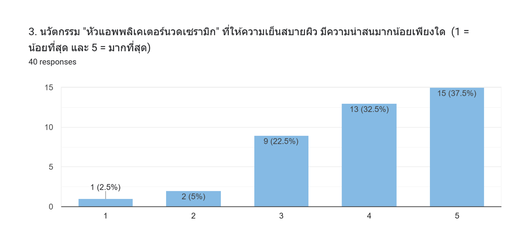
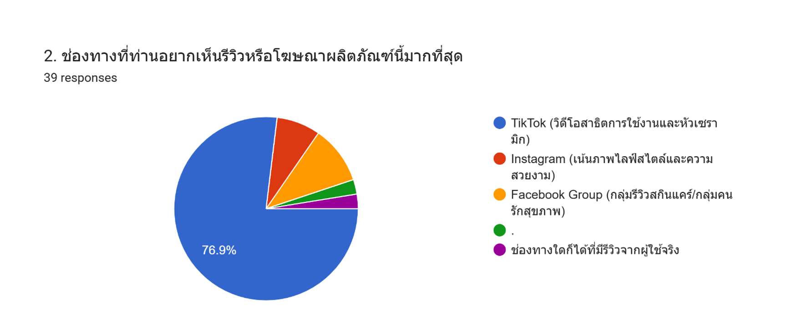
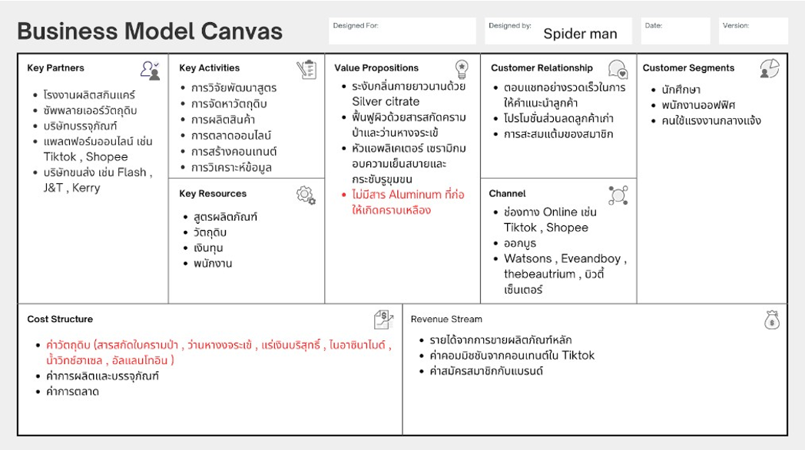
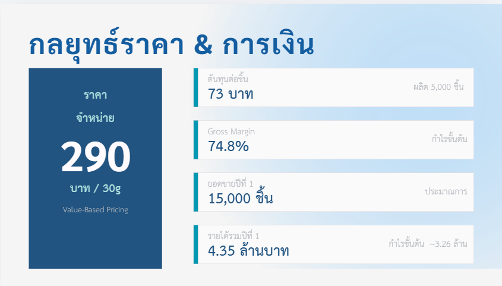
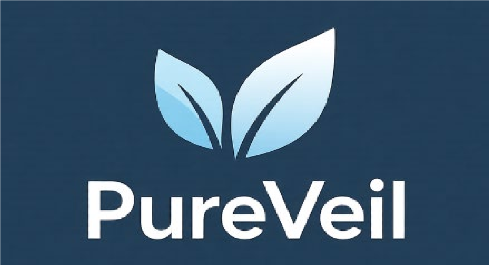
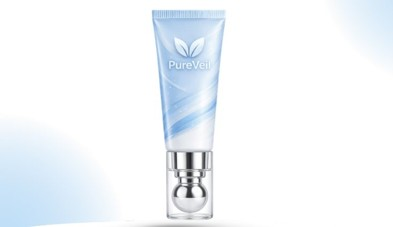
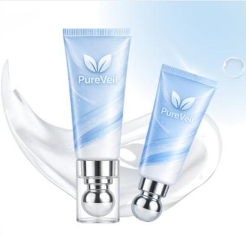

# 🍃 Pure Veil: Innovative Underarm Skincare Business Development

**Target Industry:** Health, Wellness, and Skincare Innovation  

---

## 📌 Project Overview
Pure Veil is an innovative underarm skincare solution designed for the tropical climate of Southeast Asia. Driven by the need for hygiene and skin health, Pure Veil integrates natural extracts—specifically **Indigofera (Wild Indigo)** and **Aloe Vera**—with a medical-grade **ceramic applicator**.

Our project moves beyond traditional deodorants by adopting a "Holistic Underarm Care" concept, ensuring effective odor control, anti-bacterial protection (via Silver Citrate), and skin rejuvenation (via Niacinamide and Allantoin), all while maintaining a hygienic, mess-free application experience.

## 🚀 Key Highlights & Business Impact
* **Holistic Approach:** Combines odor control, anti-bacterial science, and skin nourishing ingredients.
* **Hygienic Innovation:** Features a medical-grade ceramic applicator to prevent bacterial accumulation common in plastic roll-ons.
* **Data-Driven Strategy:** Validated through consumer surveys, identifying critical pain points like aluminum-induced clothing stains and skin sensitivity.
* **Financial Viability:** Optimized production costs with a projected **74.8% gross margin**, demonstrating high profitability and scalability.

---

## 📂 Repository Structure

### `📁 01_Market_Research`
Focuses on consumer behavior analysis. We identified that 73.2% of users are concerned about skin irritation from chemical deodorants, and 76.9% prefer TikTok for product discovery.

* **Key Pain Points:** Odor, skin darkness, and clothing stains.  
  

* **Innovation Validation:** The ceramic applicator concept scored 3.98/5 in consumer interest.  
  

* **Go-To-Market Strategy:** Target audience preference for marketing channels.  
  

---

### `📁 02_Strategic_Business_Modeling`
Structured business frameworks to ensure a sustainable entry into the skincare market.

* **Lean Canvas:** Strategic blueprint focusing on problem-solution fit and unfair advantage.  
  

* **Business Model Canvas (BMC):** Mapping our key partners, activities, and value streams.  
  

* **Value Proposition Design:** Aligning our ceramic technology and natural extracts with consumer skincare desires.  
  

---

### `📁 03_Competitive_Analysis`
Analyzing market positioning and competitive gaps.

* **Positioning Map:** Pure Veil is positioned in the **"Natural & Innovative"** quadrant.  
  

* **Competitor Matrix:** Direct comparison highlighting our competitive edge in ingredient quality and application technology.  
  

---

### `📁 04_Financial_Planning`
A detailed roadmap to profitability.

* **Financial Model:** Pricing at 290 THB/unit with a 74.8% gross margin.  
  

---

### `📁 05_Visual_Assets`
Branding elements reflecting our concept of "Pure" (purity) and "Veil" (gentle protection).

* **Brand Logo:**  
  

* **Product Design & Mockup:**  
  

---

## 🎨 Product Visuals
Product design highlighting the hygienic tube and ceramic applicator.

---

## 🛠️ Tools & Methodologies Used
* **Business Strategy:** Lean Canvas, Business Model Canvas, SWOT Analysis, Positioning Mapping
* **Data Collection & Analysis:** Google Forms (Consumer Insights)
* **Design & Presentation:** Canva (Brand Identity & Visuals)
* **Documentation:** Microsoft Word (End-to-end Project Reporting)

---
*Let's connect and discuss how data-driven business development can drive innovation in the skincare industry!*
